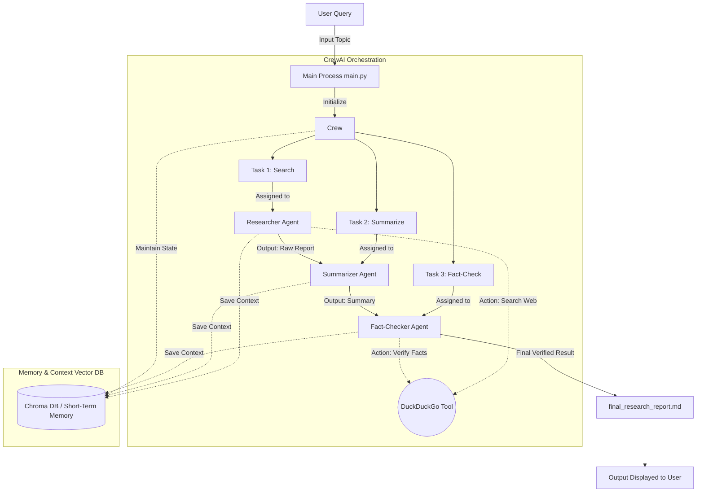

# Multi-Agent Research Assistant - System Design

## Architecture Overview

This project implements a multi-agent orchestration architecture using **CrewAI**. It enables multiple Specialized AI models (Agents) to collaborate sequentially to solve a complex problem—in this case, conducting web research, summarizing findings, and fact-checking the results.

### High-Level Architecture Flow

## Component Breakdown

### 1. The Core LLM (Google Gemini)
- **Role:** The "brain" driving the logic and reasoning for all agents. 
- **Implementation:** Integrated via `langchain-google-genai`.

### 2. Agents (The Personas)
*Defined in `agents.py`*
- **Researcher:** Uses the search tool to scrape information directly from the web based on the user's prompt.
- **Summarizer:** Receives the raw, messy data from the Researcher and structures it into a concise, readable format.
- **Fact-Checker:** Acts as the auditor. Takes the summarized text, conducts independent web searches to verify the claims, and produces the final cited document.

### 3. Tools 
*Defined in `tools.py`*
- **DuckDuckGo Search:** A Langchain community tool (`DuckDuckGoSearchRun`) that gives the agents the physical capability to browse the internet in real-time.

### 4. Memory (Vector Database)
- **Role:** Retains context across the entire agentic run. 
- **Implementation:** CrewAI natively uses an embedded vector database (typically ChromaDB) to power its memory system when `memory=True` is set on the Crew. This allows agents to recall previous searches and share context inherently without forgetting the initial goal.

### 5. Flow Control
- **Implementation:** `Process.sequential` is used in `main.py`. This ensures the tasks are handled linearly: 
  Search (Task 1) -> Summarize (Task 2) -> Fact-Check (Task 3).
